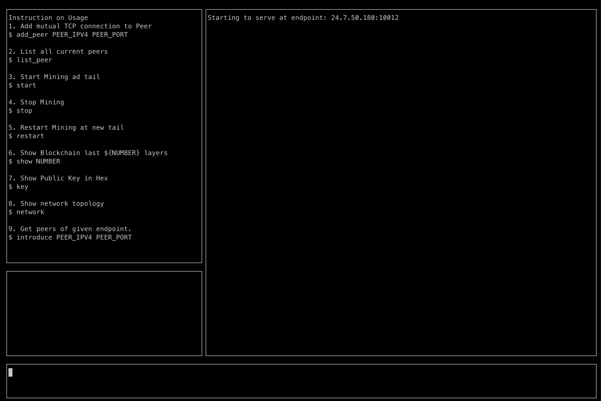
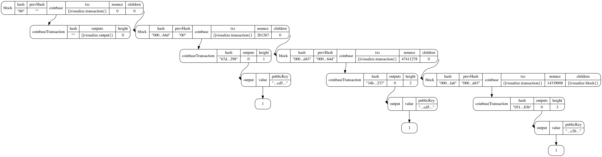
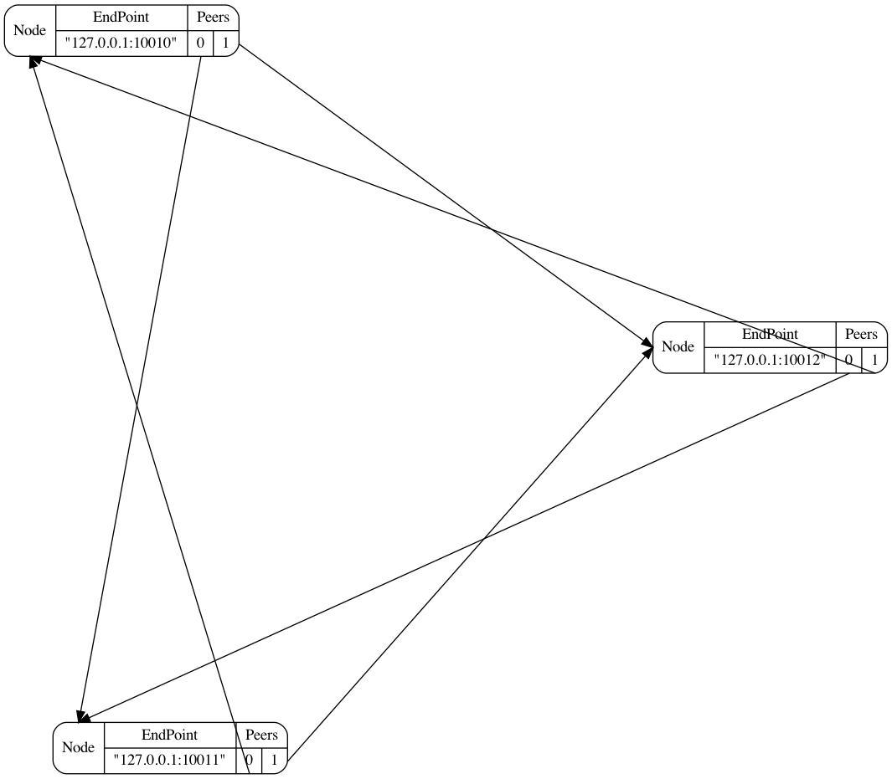
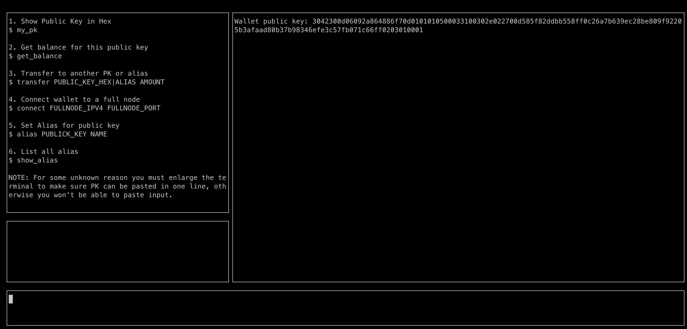

# Minimal Bitcoin

This project contains the minimal implementation of Bitcoin in Golang.

# Requirement

## Install Golang compiler

### Mac

Follow official instruction (**_recommended_**, and also the **_easiest_** way): https://golang.org/doc/install

Or

1. **Setup Your Install Path**

```bash
mkdir $HOME/Go
mkdir -p $HOME/Go/src/github.com/user
```

2. **Setup Go Import PATH**

```bash
export GOPATH=$HOME/Go
export GOROOT=/usr/local/opt/go/libexec
export PATH=$PATH:$GOPATH/bin
export PATH=$PATH:$GOROOT/bin
```

3. **Install Go Compiler**

```bash
# Install homebrew
/bin/bash -c "$(curl -fsSL https://raw.githubusercontent.com/Homebrew/install/HEAD/install.sh)"

# Using homebrew to install graphviz
brew install go
```

4. **Check Go Version**

```bash
go version
```

## Install graphvizS

### Mac

```bash
# Install homebrew
/bin/bash -c "$(curl -fsSL https://raw.githubusercontent.com/Homebrew/install/HEAD/install.sh)"

# Using homebrew to install graphviz
brew install graphviz
```

### For Linux and Windows

See https://graphviz.org/download/

# Quick Start

## Roles of Full Node

A full node takes the responsibilities of:

1. Validate the incoming blocks.
2. Broadcast the received blocks and transactions.
3. Mining to receive rewards and maintain consensus.
4. Minitoring the network and blockchain.
5. Introduce other new nodes to this network.

To start a full node with full self explanatory GUI:

```bash
# Start full node and listen for request at port 10000
go run full_node/cmd/*.go -port=10000
```

Example Screenshot:


### Functionalities

1. Add another full node peer
   Example:
   ```bash
   # Add a new peer at endpoint 127.0.0.1:10000
   add_peer 127.0.0.1 10000
   ```
2. List all current peers
   Example:

   ```bash
   list_peer
   ```

3. Start Mining

   Start mining at the current tail, note that this operation will be interrupted by new block if you set `REMINE_ON_NEW_TAIL` to true, see below for more details.

   Example:

   ```bash
   start
   ```

4. Stop Mining

   Stop all mining tasks and only listen, validate and broadcast incoming blocks

   Example:

   ```bash
   stop
   ```

5. Restart Mining

   Restart mining procedure. Most likely you won't need to proactively issue this command because mining will be restarted automatically if receiving new block.

   Example:

   ```bash
   restart
   ```

6. Show Miner's Public Key

   Example:

   ```bash
   key
   ```

7. Sync with other Fullnodes

   Proactively sync with other nodes to retrieve missing blocks, sync is in roundrobin manner to avoid overloading a peer. Most often you don't need to issue this command yourself, your blockchain will sync itself if it keeps hearing blocks whose parent hash is not in the chain.

   Example:

   ```bash
   sync
   ```

8. Show Blockchain Structure

   Show your local blockchain data structure. You'll need to install [graphviz](https://graphviz.org/) in order to do that. The number after command denotes how deep you want to retreive from the tail.

   Example:

   ```bash
   # Show last 5 layers of blockchain, including all branches.
   show 5
   ```

   Example Screenshot:
   

9. Show Network

   Start a network prober and get all nodes that you can reach (directly/indirectly) in this network.

   ```bash
   # Probe the network and get all nodes and connectivities.
   network
   ```

   Example Screenshot:
   

10. Get Peer another endpoint knows

    This is used to expand your connection to network.

    Example:

    ```bash
    # Get all nodes endpoint 127.0.0.1:10011 knows of
    introduce 127.0.0.1 10011

    ```

## Roles of Wallet

A wallet is basically the users of the system, the whole purpose of the system is to support secured and reliable transaction for waller. Wallet has only one ability:

1. Securily receive and send transactions to other wallets.

To start a wallet with full self explanatory GUI:

```bash
# Start a wallet without connecting to any full node.
go run wallet/cmd/*.go
```

> Please note that, due to some mysterious reason, your terminal must be large enough to hold the hex format public key in one line (76 characters, we're using 304 bit RSA for simplicity). It should work fine if you just make your terminal full screen.\*\*

Example Screenshot:


### Commands

1. Connect To Fullnode

   A wallet can't do anything without connecting to a fullnode first. The first thing you should do after startinga wallet is to connect one.

   Example:

   ```bash
   # Connect to fullnode at endpoint 127.0.0.1:10010
   connect 127.0.0.1 10010
   ```

2. Get Current Balance

   Get all **_confirmed_** UTXO's sum.

   Example:

   ```bash
   get_balance
   ```

3. Show Public key in Hex

   Example:

   ```bash
   my_pk
   ```

4. Transfer to another public key with amount

   Note that, you can transfer to an alias instead of the full public key.

   Example:

   ```bash
   # Transfer to public key 1.0 coin
   transfer 00ffee...0a 1.0

   # Transfer to an alias, assuming you already ran
   # alias 00ffee...0a alice
   transfer alice 1.0
   ```

5. Set Alias and show Alias

   Example:

   ```bash
   # Set public key 00ffee...0a as alias "bob"
   alias 00ffee...0a bob

   # Show all aliases
   show_alias
   ```

# Advanced Usage

## Router Port Forwarding

This project has the ability to work on internet. Since most likely you're behind a NAT, you need to set your gateway port forwarding in order to make yourself visible on the internet. See this guide on how to:

**[How to Port Forward – General Guide to Multiple Router Brands](https://www.noip.com/support/knowledgebase/general-port-forwarding-guide/)**

## WAN mode

To listen on public ip, simply use command `-wan=true`

Example:

```bash
go run full_node/cmd/*.go -port=10000 -wan=true
```

## Debug Mode

To get rid of the fancy GUI and enjoy the vanilla version, simply add flag `-debug_mode=true` when starting wallet or full node. This mode is useful when you want to log some additional information but was affected by the UI, or just don't like the UI.

Example:

```bash
# Start full node in debug mode, all logs will be print directly on console.
go run full_node/cmd/*.go -port=10000 -debug_mode=true

# Start a wallet in debug mode.
go run wallet/cmd/*.go -debug_mode=true
```

## Explicitly Set Key Storage

By default, every time you start full node or wallet, you'll read file `/tmp/mykey.pem` in your system. If it cannot find this file, it will create a new PK, SK pair and create and store into this file. You can also specify your own key storage with flag `-key_path=PATH_TO_YOUR_FILE` if you don't want to use the default, usually you want to do this when you want to start full node and test locally, but don't want to use the same identity.

Example:

```bash
# Start full node with key storage /tmp/another.pem, if not found, create this file
# and generate a new SK, PK pair, then store into this file.
go run full_node/cmd/*.go -port=10000 -key_path=/tmp/another.pem

# Start wallet with key storage /tmp/another.pem, if not found, create this file
# and generate a new SK, PK pair, then store into this file.
go run wallet/cmd/*.go -key_path=/tmp/another.pem
```

## Change Consensus Config

Bitcoin has some hyperparameters that you can tune, such as difficulty. You can also tune the parameters in this project in file `full_node/cmd/config.yaml`, which has the following parameters:

```yaml
# How many leading 0s in block hash to form a valid block.
DIFFICULTY: 25 # set to 25 to get a block every 30 seconds on a 2020 mbp 13'
# How many rewards for miner if it mined a block.
COINBASE_REWARD: 1
# How many blocks to confirm a previous block.
CONFIRMATION: 5
# Whether to interrupt mining and redo on new tail if a new valid block is received.
# If set to false it will create lots of branched/forks on the blockchain.
REMINE_ON_TAIL_CHANGE: true
# RSA length. For simplicity we choose 304 to avoid copying long public key string.
RSA_LEN: 304
```

# Further Work

There are multiple future works for this project, most importantly:

- Support SPV node and Merkel Tree for simple transaction validation.
- Support dynamic adjustment to difficulty value.
- Support scripting
